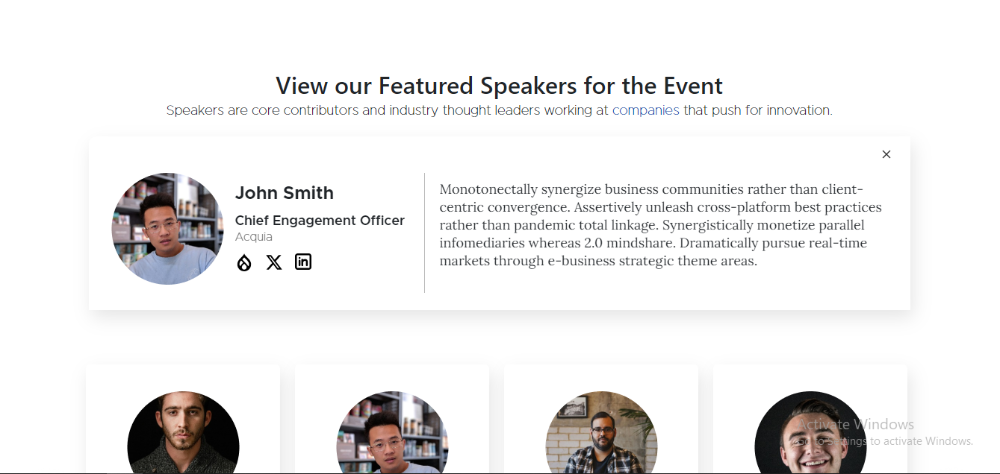
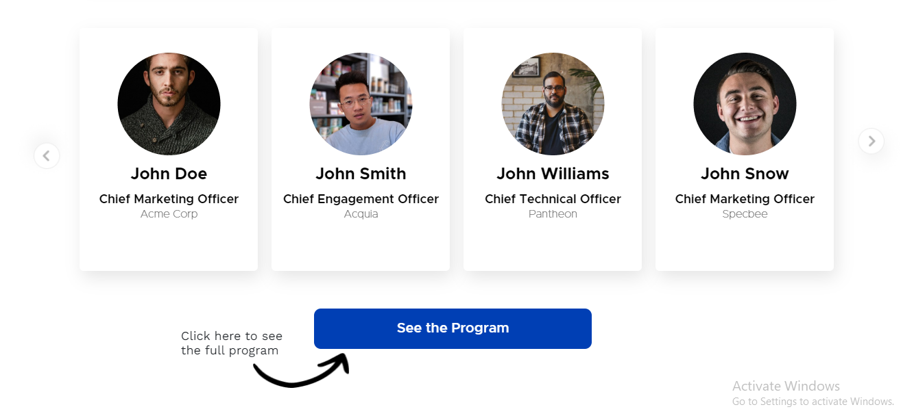
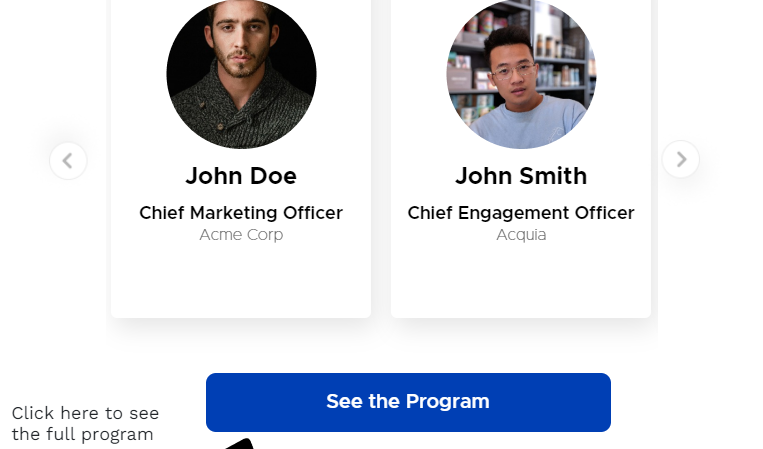

# Specbee Frontend Assignment

As a user, I was to view a Speaker component that will list out the Speakers for a conference in a slider. When a Speaker card is clicked more information will be displayed about the speaker in a popup above the fold.

## ABOUT PROJECT

This project focuses on the Speaker Carousel, a feature designed to display event speakers in a sleek, responsive layout. Users can easily browse through various speaker profiles, click on each one for more detailed information, and access related social or professional links.

## Technlogies Used

*Semantic HTML following BEM naming methodology, CSS, Vanilla  JS

*Bootstrap CSS Framework  for Carousel

*Media Queries for Responsiveness for different Screen Sizes.

## Video Demonstration of Project
 https://www.loom.com/share/3e824750d56048aa93402bfd4d8df869?sid=0e8c7d1b-919e-47e0-b936-ff3dcfd8a4b9

## Screenshots for Tablet and Mobile Responsiveness

*Laptop and Desktop Screen Size Screenshots:

*Tablet Screen Size Screenshots:

*Mobile Screen Size Screenshots:

